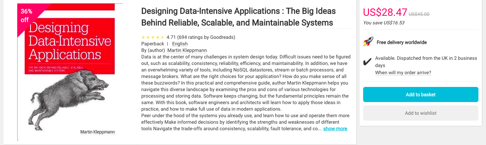

(Disclaimer: )

[BookDepository](https://www.bookdepository.com/) is well-known online book seller that belongs to Amazon.
BookDepository offers **free delivery worldwide**, so quite often I can acquire books
through BookDepository since I find better deals thatn in Amazon. 
Although I have been buying books with BookDepository for more than 7 years, I never really thought about what the **free delivery** option meant until recently. Recently, I was planning to buy the book [Designing Data-Intensive Applications : The Big Ideas Behind Reliable, Scalable, and Maintainable Systems](https://www.bookdepository.com/Designing-Data-Intensive-Applications-Martin-Kleppmann/9781449373320) and I thought of having a look if the price of this book is different based on the IP that I use to access BookDepository. So I used a VPN to login to BookDepository from Germany, as well as USA. Naturally the prices were different as you can see in the screenshots below. Buying the book from the USA the book costs $28.47, while from Germany (by converting euros to dollars) the book costs $36.31. So, I just went ahead and ordered the book while using the American IP, thus saving $7.84.

 (Book from an American IP.)

 (Book from a German IP.)

